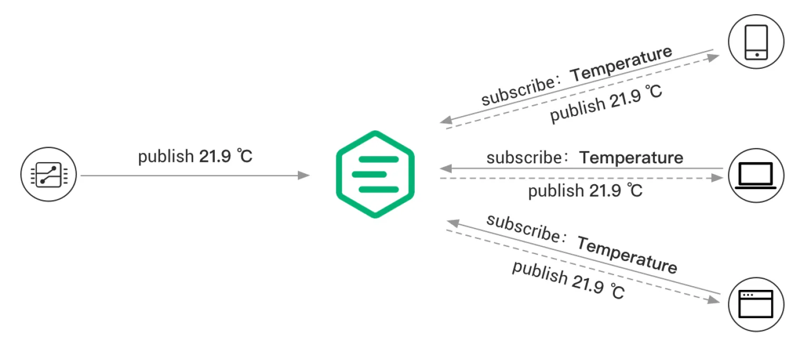

# MQTT

MQTT(Message Queuing Telemetry Transport)是一种使用 **发布/订阅** 模式的，针对窄带宽通信的应用层协议。三个关键词是 发布/订阅、窄带宽、应用层，下面分别进行讨论。

## Publish/Subscribe

发布/订阅模式。这是一种在生活中常见的通信方式，电视、报纸、直播都是很好的例子。之所以要特别提出来，是因为在电脑网络里面，最早出现的通信方式是 **客户端/服务端** 模式，或者叫做 **Request/Response** 模式，两者主要的区别是：前者是多方的，后者是双方的。假设在 **客户端/服务端** 模式下，服务器不立即通过 response 返回数据给客户端消费，而是把客户端上传的数据保存在服务器的数据库里面，由另外一个客户端来消费，那么也就等同于发布/订阅模式。

一个物联网领域的例子如下：



### Topic

主题是发布/订阅模式的核心概念，发布的内容通过主题来分类，订阅者只需要订阅关心的主题。在电视节目里面，主题等同于频道；在直播里面，主题等同于主播。为什么要有主题？根本原因在于提供发布订阅的平台（电视台、报社、直播平台）需要支持多个发布者和多个订阅者。假设我们打开电视，永远只有 CCTV-1，那么就不需要引入主题的概念了。

### Broker

Broker 这个词是比较迷惑的。在消息系统里面，Broker 是连接发布者和订阅者的系统。发布者将消息发给 Broker，订阅者找 Broker 订阅并获取消息。在上面的生活例子中，Broker 对应的是电视台、报社、直播平台，那 Broker 翻译成什么比较合适呢？Broker 直译是代理，那和 Agent 又是什么关系？

Broker 和 Agent 都是从金融领域来的，目前基本上可以认为是同义词，除了个别场景下，Broker 比 Agent 更权威，即获得 Broker 资格比获得 Agent 资格更难。

从业务角度看，Broker 非常贴近 **媒介**。媒介和代理的主要区别是媒介更具主动性，因为物联网平台可能会对数据进行过滤、清洗、格式转换。**代理**则意味着完全的透传。

从技术角度看，应该直接理解为 **消息系统对应的服务端**。

## 窄带宽

很多物联网协议的特性介绍里面都有：适用于带宽有限的场景。这引出一个有趣的哲学问题：如果一个协议在窄带宽的场景工作良好，那在**宽带宽**情况下不是能更好的工作吗？要回答这个问题，得先了解数据在网络上传输的具体实现。假设我们需要传输一段数据，如：

```json
{
    "deviceID": "imnobody",
    "temperature": "41"
}
```

我们不能直接把上面数据以纯文本的方式发送，因为计算机在解析的时候无法知道数据的长度。它就不能自己数一下吗？可以，但数到什么时候结束？于是一种常见的解决方案就出现了：在数据末尾加上结束标志。这也是 C 语言处理字符串的方式。我们很容易想到另外一种解决方案，那就是在数据前面增加一个长度，即：{长度}{数据}，这也是很多语言如 Java 处理字符串的方式。

::: tip
长度只能在数据前面而不是后面，否则计算机又陷入了`数到哪里是个头`的艰难境地
:::

由此可见，数据传输最基本的要素就是数据的长度和数据内容。其中数据的内容也被叫做**负载**（Payload）。对于自定义的非标准协议，这就足够了。而 MQTT 这类的协议，为了通用，增加了一些几乎每个协议都有的信息，如协议版本、数据类型、以及各种 flag 等。

窄带宽协议的另外一个特征是：数据传输采用**二进制**。我们可能立即会问：计算机不都是二进制的吗？这里的二进制是对比**文本**的，我们用一个例子来说明。假设我们要传输的数据是一个数字，如 1024，我们如何传输 1024 这个数字？

如果采用二进制传输，我们只需要两个字节就能表示 1024；但如果我们采用文本方式，我们需要 4 个字节。实际上，我们把 1024 拆为 4 个字符，即 '1'、'0'、'2'、'4'，进行传输。为什么我们要使用更为冗余的文本方式呢？主要有两个原因，一是在编写解析代码时更为简单；二是增加了可读性，阅读文本比阅读二进制更为方便。

::: tip
这里并不是说二进制无法阅读，只是需要先转化为文本。或者读者对二进制如此的熟悉，当看到 00000100 00000000 这样的二进制数据时，能在大脑里翻译为 1024
:::

回答上面的问题，在带宽足够的情况下，我们选择更加语义化的文本方式，在带宽有限的情况下，我们选择更为紧凑的二进制方式。

## 应用层

MQTT 是一个应用层协议，所以传输层可以是 TCP，也可以是 UDP，具体使用 TCP 还是 UDP 取决于业务场景。MQTT 也不规定设备和平台是长连接还是短连接，就像 HTTP 也可以 keep alive。不过 MQTT 一般是基于 TCP 的长连接。

以上讨论的 **发布/订阅**、**窄带宽**、**应用层** 是比较通用的话题，下面再看看 MQTT 独有的特性。

## QoS

Qos(Quality of Service)是指服务级别。MQTT 定义了三种级别，分别是：

* 级别 0：at most once。也就是消息最多发送一次，至于是否被订阅者收到，协议不做要求。这种模式适合于对数据的准确性要求不高的场景，如视频直播。

* 级别 1：at least once。也就是确保订阅者至少收到一次。实现的方式是通过收到订阅者的**回执**来确保消息已经被消费了。但这个级别可能出现消息重复发送的情况。

* 级别 2：only once。也就是订阅者一定能收到消息，且只收到一次。主要场景如 Pos 机支付系统，支付只能发生一次，且必须收到确认的回执。

## Retain Message

**保留消息** 是指发布者向 Broker 发送一条特殊的消息，当订阅者第一次订阅时，立即就能收到该消息。一个很好的例子是车辆的位置信息，如果我们在 Broker 里面总是保存车辆最新的位置信息，那么新订阅者一开始就能看到车辆的位置信息，而不需要等待。它也比较类似**群公告**，新进群的小伙伴可以立即看到。但需要注意：

* 只保留最新的一条消息
* 需要发布者上传一条空消息来删除保留消息

## Will Message

**遗嘱消息**，就像其名字所表达的一样，是在发布者还在线（世）的时候，就定义好的一个消息类型。当发布者断开时，Broker 会向所有订阅者发送这条遗嘱消息。协议并不定义其内容，通常我们可以将内容设置为 “offline”。

::: tip
通过把 Retain Message 设置为 “online”，我们可以实现当设置连接和断开时，订阅者都能收到一条消息，从而知道设备是否在线。
:::

## Session

严格来说，**会话** 不是 MQTT 特有的，很多协议如 HTTP，在实现的时候都会引入会话的概念，虽然 HTTP 是无状态的。这是因为，非常多的业务是有上下文的。一个典型的例子就是网上购物，假设我们在商品页面将某商品放入了购物车，如果我们进入购物车页面，我们期望刚刚加入购物车的商品出现在列表里面。浏览器可以通过 Set-Cookie 来实现上下文跟踪，其原理是在 Cookie 里面放入一个 SessionID（一段随机字符串），当域名相同时，每次发送请求都带上 Cookie，服务器就能根据 Cookie 里面的 SessionID 找到当前用户的上下文。

MQTT 的会话主要解决的问题是上面提到的服务级别。当服务级别为 1 或者 2 时，由于我们需要等待订阅者回执，所以需要在 Broker 暂时保存消息。

另外一个场景是，IoT 设备所处网络可能不稳定（如穿越隧道的车辆），如果设备短暂的断开和服务器的连接，重连的时候可以不用再次做认证，同时还可以立即恢复内存里面的各种状态。

::: tip
为什么断开后重连不用认证？因为设备内存里面有上次认证通过后保留的会话（SessionID）。什么时候需要重新认证？当设备重启时，因为这时内存数据被清空，也就丢掉了 SessionID。
:::
