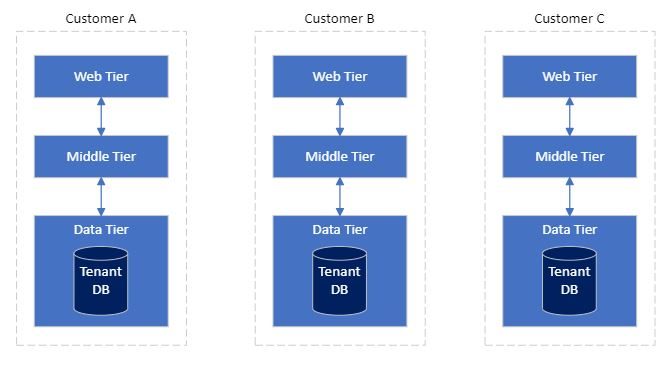
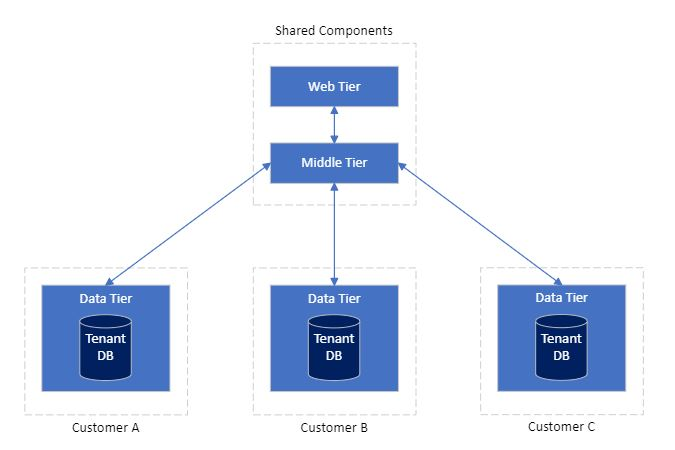
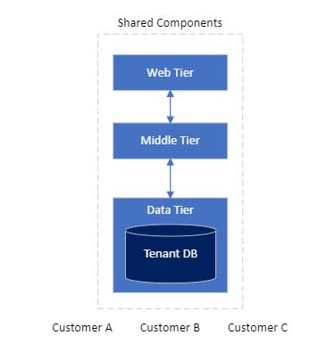

# 租户

租户模型是 SaaS 应用首要考虑的问题，因为它直接影响商业模式。而商业模式又决定了销售、产研的组织关系，所以我们有必要优先思考租户模型。

## 租户分类

常见的 SaaS 应用的租户模型分为：

1. 单租模型

在单租模型下，我们给每个客户部署一套应用。如果我们的应用是 **N-层** 架构，那么每个客户都有独立的展现层、中间件和数据库。这种模型也叫 **私有化部署** 或者 **物理多租**，适用于对数据、应用有较强管控需求的企业，一般多为大型企业。

2. 混合模型

在混合模型下，展现层和中间件是共享的，但每个客户都有自己的数据库。很多 SaaS 提供商都支持所谓的 **自定义数据库**，通常是在管理控制台上配置数据库信息。这种模型适合于对数据有管控需求的企业和场景，如用户数据需要满足当地法律法规要求、企业机密数据不能储存在 SaaS 厂商的数据库里面。

3. 多租模型

在多租模型下，我们为所有客户部署了一套应用实例，所有租户的数据都存储在 SaaS 服务商的数据库里面，只是从逻辑上进行了隔离。这种模型也叫 **逻辑多租**，适用于能够将数据和应用完全交给 SaaS 厂商托管的场景。一般来说，当我们谈到 SaaS 多租时，我们默认是指这种模型。

## 分类对比

我们选择租户模型时，重点考虑以下几个要素：

* 服务范围：产品能服务的最终用户数量
* 租户隔离：租户之间性能和数据的隔离程度
* 运行成本：单个租户使用系统的成本
* 运营成本：应用自身的管理成本，包括自动化、安全、监控、运维、统计、部署等动作的成本

一般来说，不同租户模型不会影响应用的功能，但会对以上要素有较大影响，下表做了一个汇总：

| 要素     | 单租模型 | 混合模型 | 多租模型 |
| -------- | ----- | --------------- | ----------------------- |
| 服务范围 | 中 | 高 | 非常高 |
| 租户隔离 | 非常高 | 高 | 低 |
| 运行成本 | 高 | 中 | 低 |
| 运营成本 | 单个低、整体高 | 中 | 低 |

## IoT 平台租户

平台在管理租户时，有一个重要功能是计量计费，对于通用的 SaaS 软件，一般按照调用次数或者某种业务使用量来计费，比如认证系统可能会根据活跃用户数收费。在 IoT 领域，可以根据`注册设备数量`、`在线设备数量`、`每日消息数量`、`消息 TPS`等维度进行收费。

我们不能简单的认为租户就是客户或者租户对应的一个账户。一个客户可以有多个租户，最典型的例子是测试环境和生产环境隔离，即测试环境和生产环境是同一个客户下面的两个独立租户。另外，租户本身是带业务含义的，这也是为什么不同领域的平台对租户的称呼是不同的。比如在认证领域，一个租户可以被称作`用户池`，在电商领域，一个租户可以称作`商家`。

::: tip
在 IoT 领域，不同的平台对`租户`的叫法不一样，比如在阿里 IoT 云叫`实例`，Azure IoT 云叫做 `IoT Hub`
:::